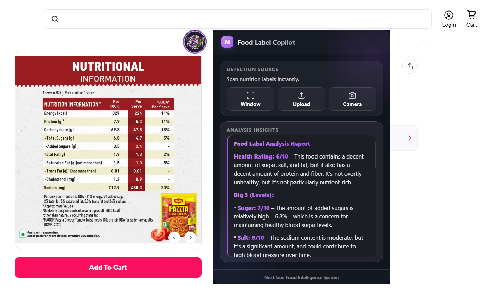

# 🥗 Food Label Copilot (Offline AI Prototype)

Food Label Copilot is an **offline-first AI Copilot** that helps users understand **food nutrition labels in very simple, everyday language**.

Instead of using cloud APIs, this project uses **Ollama with local LLMs**, making it:
- Private
- Fast
- Internet-independent (after setup)

This is a **working prototype** and the foundation for a future full Copilot-style product.



---

## 🚀 What This Project Does

Food Label Copilot allows users to:

- Scan food nutrition labels directly from their screen
- Upload nutrition label images
- Scan physical products using a camera
- Understand food labels in **plain language**
- Avoid misleading food advertisements
- Make healthier and informed food choices

All processing is done **locally** using:
- OCR (for text extraction)
- Ollama (for AI explanation)

---

## 🧠 Key Features

- 🧷 Floating Copilot UI (always on screen)
- 🖼️ OCR-based text extraction using EasyOCR
- 🤖 Offline LLM processing using Ollama
- 🧾 Simple, honest explanations (no scientific jargon)
- ⚡ Fast & lightweight
- 🛑 Food label detection (prevents wrong scans)
- 🔒 Privacy-first (no data sent to the cloud)

---

## 🛠️ Tech Stack

- **Python 3.10+**
- **PySide6 (Qt)**
- **EasyOCR**
- **Pillow (PIL)**
- **Ollama (offline LLM)**
- **HTML, CSS, JavaScript (UI)**

---

## 📂 Project Structure

```
project-root/
│
├── copilot
|  ├── start.py # Main entry point
|  ├── bridge.py # OCR + Ollama processing logic
|  ├── float.py  # Supporting File
|  ├── copilot.py # Supporting File
|  ├── ui/
|  │ ├── index.html # Copilot UI
|  │ ├── styles.css
|  │ └── script.js
|  ├── requirements.txt
├──index.html # main webpage
└── README.md
```

## 📦 Installation (Complete Setup in One Go)

```bash
# --------------------------------------------------
# 1. Clone the repository or Download copilot.zip
# --------------------------------------------------


# --------------------------------------------------
# 2. (Optional but recommended) Create virtual env
# --------------------------------------------------
python -m venv venv

# Activate virtual environment
# Windows
venv\Scripts\activate

# Linux / macOS
source venv/bin/activate


# --------------------------------------------------
# 3. Install Python dependencies
# --------------------------------------------------
pip install -r requirements.txt


# --------------------------------------------------
# 4. Install Ollama (Offline LLM)
# --------------------------------------------------
# Download Ollama from:
# https://ollama.com/download
#
# Install it according to your OS, then verify:
ollama --version


# --------------------------------------------------
# 5. Pull an offline LLM model
# --------------------------------------------------
# Recommended lightweight models:
ollama pull gemma:1b


# --------------------------------------------------
# 6. Start Ollama local server
# --------------------------------------------------
ollama serve
# Ollama will run at: http://localhost:11434


# --------------------------------------------------
# 7. Run the Food Label Copilot
# --------------------------------------------------
python start.py


